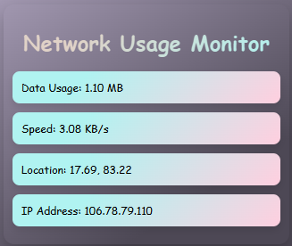

# Network Usage Monitor

## Overview

The Network Usage Monitor Chrome Extension provides real-time monitoring of network data usage and speed directly from your browser. It displays data usage in bytes and speed in bytes per second, along with location details and IP address retrieval.

 <!-- Replace with an actual image of your extension -->

## Features

- **Real-time Data Usage:** Tracks data usage and speed of network activity.
- **Location Information:** Retrieves and displays the user's geolocation.
- **IP Address:** Fetches and shows the user's current IP address.
- **Popup Display:** Aesthetic popup interface for easy monitoring.

## Technologies Used

- **JavaScript:** Core language used for extension functionality.
- **Chrome Extensions API:** Utilized for web requests, storage, and message passing.
- **HTML/CSS:** Structuring and styling the popup interface.
- **Fetch API:** Used for retrieving IP address information.
- **Geolocation API:** Accessed for retrieving user's location.

## How to Use

1. **Installation:**
   - Clone or download the repository.
   - Open Chrome and go to `chrome://extensions/`.
   - Enable Developer mode and click on "Load unpacked".
   - Select the extension directory to install.

2. **Usage:**
   - Click on the extension icon to open the popup.
   - Monitor real-time data usage, speed, location, and IP address.

## Future Updates

This version of the extension provides basic functionality. Future updates will focus on enhancing accuracy, adding more detailed metrics, and improving usability based on user feedback.

## Known Issues

- Accuracy of data measurements may vary based on network conditions and Chrome's processing capabilities.

## Contributing

Contributions are welcome! If you find any issues or have suggestions for improvements, please submit an issue or pull request.

## License

This project is licensed under the MIT License - see the LICENSE file for details.
